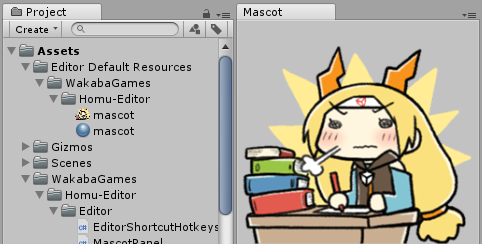
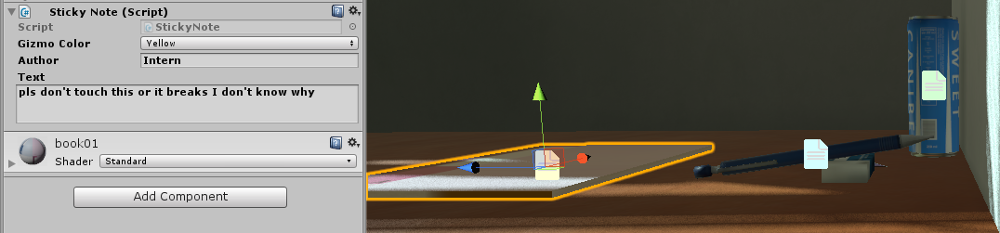

# Homu-Editor
Collection of utilities for the Unity Editor.  

[MIT License](LICENSE)  
You may use these freely provided you give credit to "Teh Lemon" and include a copy of the above license.  
I make no promises over the quality or up-to-date-ness of the code.

# Install
Copy the contents of the Assets folder into your project's Assets folder.  
Anything in the Assets/WakabaGames folder can be moved as you wish but any scripts found in an "Editor" folder must also be in a folder named Editor.  
The "Gizmos" and "Editor Default Resources" folders must be placed in the root of your project's "Assets" folder. These can't be moved.  
Some of these may require setting Unity to use .net 4.6/C# 6.0.  
These are only tested against whichever Unity version I happen to be using (usually the latest).  
Any extra instructions will listed in the comments at the top of the files or functions.  

# Contents

## Extra Hotkeys (EditorShortcutHotkeys.cs)
**Alt+D** in the Editor to deselect all game objects in the scene.  
**F5** to Play/Stop the game.  

## Game View Tracker (ToggleGameViewTracking.cs)
Modified version of the one from Unity's Book of the Dead.  
This keeps the main camera synced with the scene view while enabled.  
Useful when testing visual effects that only show up in game view.  
Found in the **Tools** menu or use **ctrl+T**.

## Generate Scripts from Templates (ScriptGenerator.cs and the Editor Default Resources folder)
Create new scripts based on the templates provided in the Editor Default Resources folder.  
Use this if you're tired of Unity constantly overwriting your custom script templates every update.  
Instructions and customizations can be found inside ScriptGenerator.cs file.

## Mascot Panel (MascotPanel.cs and the Editor Default Resources folder)
A panel for the Editor that displays an image for that needed boost in motivation.  
Access from the **Windows/Mascot** menu.  
Name your image "mascot" and place it in the folder "**Assets/Editor Default Resources/Mascot**".  
You can customize the path and filename in the file.  

## Revert to Prefab (RevertAllPrefabs.cs)
Reverts all the selected gameobjects in the Editor back to their prefab state.  
Found in the **Tools** menu.

## Simulate Physics (SimulatePhysicsEditor.cs)
Manually simulates the physics on selected game objects in the editor until they've come to rest.  
Use this to scatter a bunch of objects around the scene in a natural way without having to carefully place each one on the ground by hand.  
Only select game objects that have colliders but no rigidbodies. It will automatically add the rigidbodies and remove them afterwards.  
Found in the **Tools** menu.

## Sticky Notes (StickyNote.cs and the Gizmos folder)  
In-Scene view sticky notes represented with gizmos. Useful for long-term or team projects.  
Just add the **WakabaGames/StickyNote component** onto any gameobject.  
Add it onto an empty game object if you want to move it around.  

# Homu Suite

Also consider checking out the other packages in the [Homu Suite](https://github.com/search?q=Teh-Lemon%2FHomu) for Unity.
