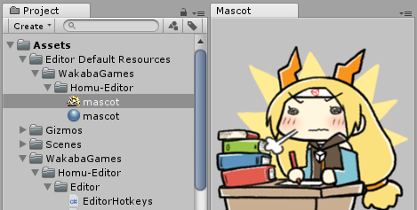

# Homu-Editor
Collection of utilities for the Unity Editor.  

Any scripts found in the "Editor" folder must also be in an Editor folder in your project.  
The "Gizmos" and "Editor Default Resources" must be placed in the root of the "Assets" folder.  
Any extra instructions will listed in the comments at the top of the file or functions.  
Some of these may require setting Unity to use .net 4.6/C# 6.0.  
These are only tested against whichever Unity version I happen to be using (usually the latest).

I make no promises over the quality or up-to-date-ness of the code.  

# Contents

## Extra Hotkeys (EditorShortcutHotkeys.cs)
**Alt+D** in the Editor to deselect all game objects in the scene.  
**F5** to Play/Stop the game.  

## Mascot Panel (MascotPanel.cs and the Editor Default Resources folder)
A panel for the Editor that displays an image.  
Access from the **Windows/Mascot** menu.  
Name your image "mascot" and place it in the folder "**Assets/Editor Default Resources/**".  
Supports .jpg, .png and static .gif. Though you can easily add more formats.  

## Revert to Prefab (RevertAllPrefabs.cs)
Reverts all the selected gameobjects in the Editor back to their prefab state.  
Found in the **Tools** menu.

## Sticky Notes (StickyNote.cs and the Gizmos folder)  
In-Scene view sticky notes represented with gizmos. Useful for long-term or team projects.  
Just add the **WakabaGames/StickyNote component** onto any gameobject.  
Add it onto an empty (child) game object if you want to move it around.  
